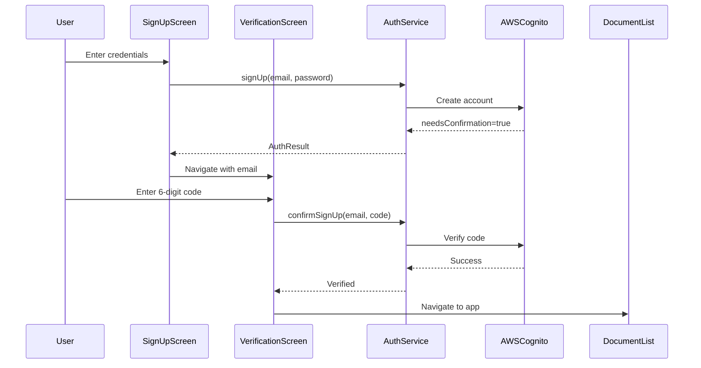

# Email Verification Flow - Design Document

## Overview

This design implements a complete email verification flow for the Household Docs application. The solution adds a new verification screen, extends the authentication service with verification methods, and updates the sign-up and sign-in flows to handle unverified accounts. The design ensures users can successfully verify their email addresses using codes sent by AWS Cognito, providing a seamless onboarding experience.

## Architecture

### High-Level Flow

```
Sign Up → Verification Screen → Enter Code → AWS Cognito Verification → Document List
                ↓                                        ↓
           Resend Code                            Error Handling
```

### Component Interaction



## Components and Interfaces

### 1. VerificationScreen (New)

A Flutter StatefulWidget that provides the UI for email verification.

**State:**
- `_verificationCodeController`: TextEditingController for code input
- `_isLoading`: bool for loading state
- `_isResending`: bool for resend operation state
- `_errorMessage`: String? for displaying errors
- `email`: String passed via constructor/navigation

**Methods:**
- `_handleVerification()`: Submits code to authentication service
- `_handleResendCode()`: Requests new verification code
- `_isCodeValid()`: Validates code format (6 digits)
- `_getErrorMessage(String error)`: Maps error codes to user-friendly messages

**UI Elements:**
- Email display (read-only)
- Verification code input field (numeric, 6 digits)
- Verify button (enabled when code is valid)
- Resend code button
- Back to sign-in link
- Error message container
- Loading indicators

### 2. AuthenticationService (Extended)

Extends the existing authentication service with verification methods.

**New Methods:**

```dart
/// Confirm user sign-up with verification code
Future<AuthResult> confirmSignUp(String email, String confirmationCode)

/// Resend verification code to user's email
Future<void> resendSignUpCode(String email)
```

**Error Handling:**
- `CodeMismatchException`: Invalid verification code
- `ExpiredCodeException`: Code has expired
- `LimitExceededException`: Too many attempts
- `UserNotFoundException`: User doesn't exist
- `NotAuthorizedException`: Already verified or other auth issue

### 3. SignUpScreen (Modified)

Update to handle verification flow after successful sign-up.

**Changes:**
- Check `AuthResult.needsConfirmation` after sign-up
- Navigate to `VerificationScreen` instead of showing success message
- Pass user's email to verification screen

### 4. SignInScreen (Modified)

Update to handle unverified users attempting to sign in.

**Changes:**
- Catch `UserNotConfirmedException` during sign-in
- Navigate to `VerificationScreen` with email
- Display appropriate message about verification requirement

## Data Models

### AuthResult (Extended)

The existing `AuthResult` class already has the necessary fields:

```dart
class AuthResult {
  final bool success;
  final String message;
  final bool needsConfirmation;  // Already exists
}
```

No changes needed to the data model.

### Navigation Arguments

```dart
class VerificationScreenArguments {
  final String email;
  final bool fromSignIn;  // true if navigating from sign-in, false from sign-up
  
  VerificationScreenArguments({
    required this.email,
    this.fromSignIn = false,
  });
}
```

## Correctness Properties

*A property is a characteristic or behavior that should hold true across all valid executions of a system-essentially, a formal statement about what the system should do. Properties serve as the bridge between human-readable specifications and machine-verifiable correctness guarantees.*

### Property 1: Verification code validation

*For any* string input to the verification code field, the verify button should be enabled if and only if the string contains exactly 6 numeric digits.
**Validates: Requirements 2.3, 2.4, 2.5**

### Property 2: AWS Cognito confirmation invocation

*For any* valid email and 6-digit code, calling confirmSignUp should invoke AWS Amplify's confirmSignUp method exactly once with those parameters.
**Validates: Requirements 3.1, 7.1**

### Property 3: Navigation after successful verification

*For any* user who successfully verifies their account, the system should navigate to the document list screen and not remain on the verification screen.
**Validates: Requirements 3.2**

### Property 4: Error message display for invalid codes

*For any* verification attempt that returns CodeMismatchException from AWS, the system should display an error message indicating the code is invalid.
**Validates: Requirements 3.3**

### Property 5: Resend code clears input

*For any* successful resend operation, the verification code input field should be cleared.
**Validates: Requirements 4.3**

### Property 6: Unverified sign-in detection

*For any* sign-in attempt that throws UserNotConfirmedException, the system should navigate to the verification screen with the user's email.
**Validates: Requirements 6.1, 6.2**

### Property 7: Numeric input restriction

*For any* non-numeric character entered in the verification code field, the input should be rejected and the field value should remain unchanged.
**Validates: Requirements 2.1, 2.2**

### Property 8: Loading state during verification

*For any* verification request in progress, the verify button should be disabled and a loading indicator should be visible.
**Validates: Requirements 3.5**

## Error Handling

### User-Facing Errors

| AWS Cognito Error | User Message | Action Available |
|-------------------|--------------|------------------|
| CodeMismatchException | "Invalid verification code. Please check and try again." | Retry, Resend |
| ExpiredCodeException | "Verification code has expired. Please request a new code." | Resend |
| LimitExceededException | "Too many attempts. Please wait a moment and try again." | Wait, Resend |
| UserNotFoundException | "Account not found. Please sign up again." | Back to sign-in |
| NotAuthorizedException | "Account already verified. Please sign in." | Back to sign-in |
| NetworkException | "Network error. Please check your connection." | Retry |
| Generic Error | "Verification failed. Please try again." | Retry, Resend |

### Error Recovery

1. **Invalid Code**: User can immediately retry with correct code
2. **Expired Code**: User must request new code via resend button
3. **Network Error**: User can retry when connection is restored
4. **Too Many Attempts**: User must wait before retrying (AWS enforced)
5. **Already Verified**: User redirected to sign-in screen

### Logging

All verification operations should log:
- Verification attempts (success/failure)
- Resend code requests
- Navigation events
- Error types and messages

## Testing Strategy

### Unit Tests

1. **VerificationScreen Widget Tests**
   - Code input validation (6 digits, numeric only)
   - Button enable/disable states
   - Error message display
   - Navigation behavior

2. **AuthenticationService Tests**
   - `confirmSignUp()` calls AWS Amplify correctly
   - `resendSignUpCode()` calls AWS Amplify correctly
   - Error mapping and exception handling
   - Success result formatting

3. **Integration Tests**
   - Sign-up flow navigates to verification
   - Unverified sign-in navigates to verification
   - Successful verification navigates to document list
   - Resend code functionality

### Property-Based Tests

Property-based tests will use the `test` package with custom generators for comprehensive input validation.

1. **Property 1 Test: Code validation**
   - Generate random strings of various lengths and character types
   - Verify button state matches "exactly 6 numeric digits" rule

2. **Property 2 Test: AWS invocation**
   - Generate random valid email/code pairs
   - Mock AWS Amplify and verify correct method calls

3. **Property 7 Test: Numeric input restriction**
   - Generate random characters (letters, symbols, etc.)
   - Verify non-numeric characters are rejected

### Edge Cases

- Empty verification code
- Code with spaces or special characters
- Very long input strings
- Rapid button clicking (debouncing)
- Network timeout during verification
- App backgrounding during verification
- Multiple resend requests in quick succession

### Manual Testing Scenarios

1. Complete sign-up and verification flow
2. Request resend code and verify with new code
3. Enter incorrect code multiple times
4. Sign in with unverified account
5. Verify account then sign in
6. Navigate back from verification screen
7. Test with poor network conditions

## UI/UX Design

### Verification Screen Layout

```
┌─────────────────────────────────┐
│  ← Back                         │
├─────────────────────────────────┤
│                                 │
│         📧 (Email Icon)         │
│                                 │
│      Verify Your Email          │
│                                 │
│  We sent a verification code to │
│      user@example.com           │
│                                 │
│  ┌───────────────────────────┐ │
│  │  [  ][  ][  ][  ][  ][  ] │ │
│  └───────────────────────────┘ │
│                                 │
│  ┌───────────────────────────┐ │
│  │      Verify Account       │ │
│  └───────────────────────────┘ │
│                                 │
│  Didn't receive the code?       │
│  [Resend Code]                  │
│                                 │
│  [Back to Sign In]              │
│                                 │
└─────────────────────────────────┘
```

### Visual Design Principles

1. **Consistency**: Match existing authentication screens (sign-in, sign-up)
2. **Clarity**: Clear instructions and prominent code input
3. **Feedback**: Immediate visual feedback for all actions
4. **Accessibility**: Proper labels, contrast ratios, and screen reader support

### Color Scheme

- Primary action button: Theme primary color
- Error messages: Red (#D32F2F) with light red background
- Success messages: Green (#388E3C) with light green background
- Disabled states: Grey with reduced opacity

## Implementation Notes

### Code Input Field

Consider using a specialized code input widget or package (e.g., `pin_code_fields`) for better UX:
- Individual boxes for each digit
- Auto-focus next box on input
- Auto-submit on 6th digit (optional)
- Easy deletion and editing

### State Management

Use StatefulWidget with local state for simplicity:
- No need for complex state management
- Verification is a one-time, linear flow
- State doesn't need to persist across app restarts

### Navigation Strategy

Use `Navigator.pushReplacement()` for verification screen:
- Prevents users from going back to sign-up after starting verification
- Maintains clean navigation stack
- Use `Navigator.pop()` for "Back to Sign In" action

### AWS Amplify Integration

The authentication service will use:
- `Amplify.Auth.confirmSignUp()` for verification
- `Amplify.Auth.resendSignUpCode()` for resending codes
- Proper exception handling for all Cognito error types

### Security Considerations

1. **No Code Storage**: Never store verification codes locally
2. **Rate Limiting**: Respect AWS Cognito rate limits
3. **Input Sanitization**: Validate all user inputs
4. **Error Messages**: Don't reveal sensitive information in errors
5. **Session Management**: Clear any temporary state on navigation

## Future Enhancements

1. **Auto-fill Support**: Detect verification codes from SMS/email (iOS/Android)
2. **Countdown Timer**: Show time remaining before code expires
3. **Biometric Verification**: Alternative verification methods
4. **Email Change**: Allow users to update email if entered incorrectly
5. **Offline Support**: Queue verification for when connection restored
