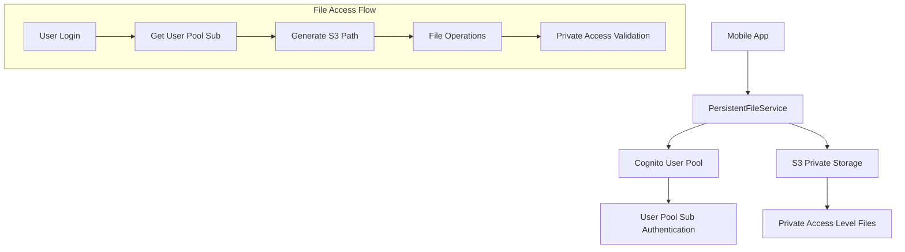

# Design Document

## Overview

The Persistent File Access system ensures that users maintain consistent access to their S3 files across app reinstalls and device changes by leveraging AWS Cognito User Pool sub identifiers with S3 private access level. This design follows AWS best practices for user authentication and file isolation while providing seamless user experience.

## Architecture

### High-Level Architecture



### Component Interaction

1. **PersistentFileService**: Central service managing file operations using User Pool sub
2. **Cognito User Pool**: Provides persistent user authentication and sub identifier
3. **S3 Private Storage**: Stores files using private access level with User Pool authentication
4. **File Migration Service**: Handles migration from existing file path structures

## Components and Interfaces

### PersistentFileService

```dart
class PersistentFileService {
  // Core file operations
  Future<String> uploadFile(String filePath, String syncId);
  Future<String> downloadFile(String s3Key, String syncId);
  Future<void> deleteFile(String s3Key);
  
  // Path management
  Future<String> generateS3Path(String syncId, String fileName);
  Future<String> getUserPoolSub();
  
  // Migration support
  Future<void> migrateUserFiles();
  Future<List<String>> findLegacyFiles();
}
```

### FilePath Model

```dart
class FilePath {
  final String userSub;
  final String syncId;
  final String fileName;
  final String fullPath;
  final DateTime createdAt;
  final bool isLegacy;
  
  // Generate private access path: private/{userSub}/documents/{syncId}/{fileName}
  String get s3Key => 'private/$userSub/documents/$syncId/$fileName';
}
```

### Enhanced File Sync Manager Interface

```dart
abstract class EnhancedFileSyncManager {
  Future<String> uploadFileWithUserSub(String filePath, String syncId);
  Future<String> downloadFileWithUserSub(String s3Key, String syncId);
  Future<void> deleteFileWithUserSub(String s3Key);
}
```

## Data Models

### S3 File Path Structure

```
private/{userSub}/documents/{syncId}/{timestamp}-{fileName}
```

**Example:**
```
private/12345678-1234-1234-1234-123456789012/documents/sync_abc123/1640995200000-document.pdf
```

### File Migration Mapping

```dart
class FileMigrationMapping {
  final String legacyPath;
  final String newPath;
  final String userSub;
  final DateTime migratedAt;
  final bool verified;
}
```

### Local Database Schema (if needed for migration tracking)

```sql
CREATE TABLE file_migrations (
  id TEXT PRIMARY KEY,
  user_sub TEXT NOT NULL,
  legacy_path TEXT NOT NULL,
  new_path TEXT NOT NULL,
  migrated_at DATETIME NOT NULL,
  verified BOOLEAN DEFAULT FALSE,
  UNIQUE(user_sub, legacy_path)
);

CREATE INDEX idx_file_migrations_user_sub ON file_migrations(user_sub);
```

## Correctness Properties

*A property is a characteristic or behavior that should hold true across all valid executions of a system-essentially, a formal statement about what the system should do. Properties serve as the bridge between human-readable specifications and machine-verifiable correctness guarantees.*

### Property 1: User Pool Sub Consistency
*For any* authenticated user, retrieving their User Pool sub should return the same value across multiple app sessions and device changes.
**Validates: Requirements 1.1, 2.1**

### Property 2: File Access Consistency
*For any* file uploaded by a user, that file should remain accessible after app reinstall when using the User Pool sub-based path system.
**Validates: Requirements 1.2, 5.1**

### Property 3: Path Generation Determinism
*For any* given user sub, sync ID, and filename, the generated S3 path should be identical across multiple invocations.
**Validates: Requirements 3.1, 5.4**

### Property 4: Private Access Security
*For any* file operation, only the authenticated user (verified by User Pool sub) should be able to access files in their private directory.
**Validates: Requirements 6.3, 6.4**

### Property 5: Migration Completeness
*For any* user being migrated to the new system, all previously accessible files should remain accessible after migration using the new path structure.
**Validates: Requirements 8.1, 8.4**

### Property 6: Cross-Device Consistency
*For any* user accessing files from multiple devices, the same User Pool sub should provide access to the same set of files regardless of the device.
**Validates: Requirements 2.1, 2.4**

## Error Handling

### Error Categories and Responses

1. **AWS Authentication Errors**
   - User Pool authentication failure: Redirect to login, clear cached credentials
   - Token expiration: Automatic token refresh, retry operation
   - User not found: Clear local state, require re-authentication

2. **S3 Access Errors**
   - Access denied: Validate User Pool authentication, check file path format
   - File not found: Log warning, return appropriate error to user
   - Network timeout: Retry with exponential backoff

3. **Data Integrity Errors**
   - Invalid User Pool sub: Re-authenticate user, regenerate paths
   - Corrupted file paths: Attempt path reconstruction, log for investigation
   - Missing user context: Require user re-authentication

### Error Recovery Strategies

```dart
class FileOperationErrorHandler {
  Future<String> handleFileError(Exception error, String operation) async {
    if (error is AuthException) {
      return await handleAuthError(error);
    } else if (error is StorageException) {
      return await handleStorageError(error);
    } else {
      return await handleGenericError(error);
    }
  }
  
  Future<void> retryWithBackoff(Function operation, int maxRetries) async {
    // Implement exponential backoff retry logic
  }
}
```

## Testing Strategy

### Unit Testing Approach

**Core Logic Tests**:
- User Pool sub retrieval and validation
- S3 path generation and consistency
- File operation error handling and retry mechanisms
- Migration logic and path mapping

**Mock Dependencies**:
- Mock Cognito User Pool for authentication operations
- Mock S3 operations for file access testing
- Mock network conditions for error scenario testing
- Mock user contexts for multi-user testing

### Property-Based Testing Approach

**Property Test Framework**: Use `test` package with custom property generators for Dart

**Test Generators**:
- Generate valid User Pool sub formats
- Generate user scenarios (new user, existing user, migrating user)
- Generate file operation sequences
- Generate error conditions (network failures, authentication issues)

**Property Test Examples**:
```dart
// Property 1: User Pool Sub Consistency
testProperty('User Pool sub consistency across sessions', () {
  forAll(userGenerator, (user) async {
    final service = PersistentFileService();
    final userSub1 = await service.getUserPoolSub();
    
    // Simulate app restart
    await service.clearCache();
    
    final userSub2 = await service.getUserPoolSub();
    expect(userSub2, equals(userSub1));
  });
});

// Property 2: File Access Consistency
testProperty('File access after app reinstall', () {
  forAll(fileUploadGenerator, (fileData) async {
    // Upload file with User Pool sub path
    final originalS3Key = await uploadFile(fileData);
    
    // Simulate app reinstall
    await simulateAppReinstall();
    
    // Verify file is still accessible with same User Pool sub
    final downloadResult = await downloadFile(originalS3Key);
    expect(downloadResult.isSuccess, isTrue);
  });
});

// Property 3: Path Generation Determinism
testProperty('S3 path generation determinism', () {
  forAll(pathInputGenerator, (userSub, syncId, fileName) async {
    final service = PersistentFileService();
    
    final path1 = await service.generateS3Path(syncId, fileName);
    final path2 = await service.generateS3Path(syncId, fileName);
    
    expect(path1, equals(path2));
    expect(path1, startsWith('private/$userSub/documents/'));
  });
});
```

### Integration Testing Strategy

**AWS Integration Tests**:
- Test actual Cognito User Pool authentication
- Test S3 private access level operations with User Pool auth
- Test cross-device file access scenarios
- Test migration from existing file structures

**End-to-End Testing Scenarios**:
1. New user registration and first file upload
2. App reinstall and file access verification
3. Multi-device usage with consistent file access
4. Migration from existing username-based paths to User Pool sub paths
5. Error scenarios and recovery mechanisms

### Performance Testing

**Metrics to Monitor**:
- User Pool sub retrieval latency
- S3 file operation performance with private access
- File path generation performance
- Migration operation duration
- Memory usage of file service operations

**Load Testing Scenarios**:
- Concurrent file operations with User Pool authentication
- High-frequency file uploads/downloads
- Large-scale user migration scenarios
- Error recovery under load conditions