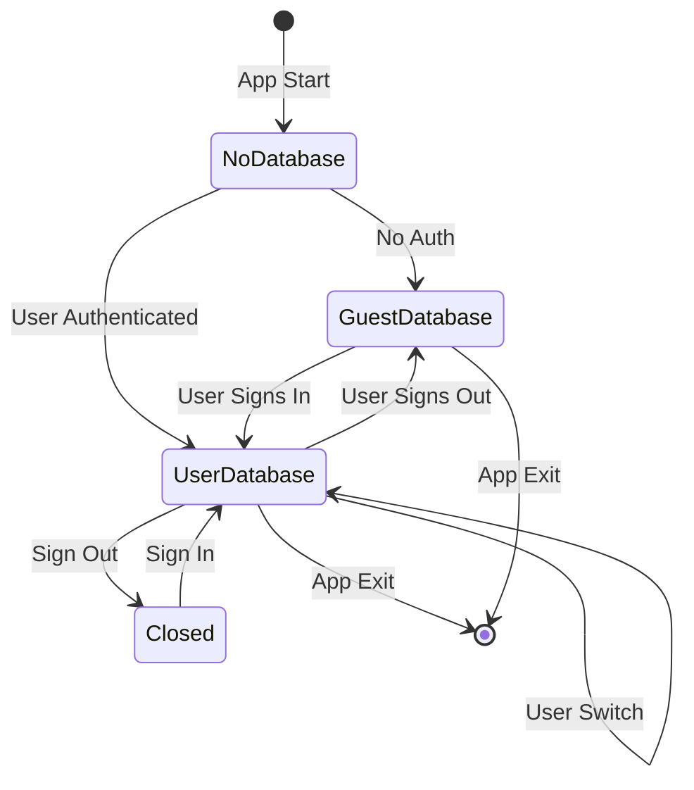
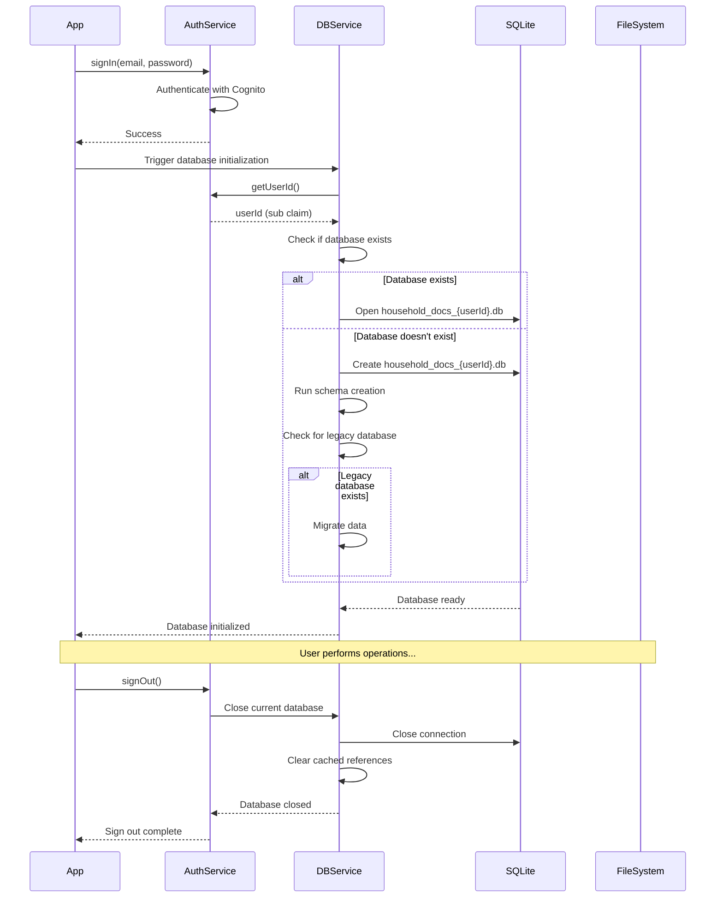

# User-Scoped Database - Design Document

## Overview

This design implements user-scoped SQLite databases to ensure complete data isolation between users. Each authenticated user will have their own database file identified by their Cognito User ID (sub claim). The solution includes automatic database switching during authentication events, migration from the legacy shared database, user-specific file storage, and comprehensive error handling. This addresses a critical security vulnerability where users could see other users' documents due to a shared database.

## Architecture

### High-Level Architecture

```
┌─────────────────────────────────────────────────────────────┐
│                     Application Layer                        │
│  (Screens, Widgets, Business Logic)                         │
└─────────────────────┬───────────────────────────────────────┘
                      │
                      ▼
┌─────────────────────────────────────────────────────────────┐
│              Authentication Service                          │
│  - Sign In / Sign Out                                       │
│  - Get User ID (Cognito sub)                                │
│  - Auth State Stream                                        │
└─────────────────────┬───────────────────────────────────────┘
                      │
                      ▼
┌─────────────────────────────────────────────────────────────┐
│           Database Service (Modified)                        │
│  - User-Scoped Database Management                          │
│  - Database Lifecycle (Open/Close/Switch)                   │
│  - Migration from Legacy Database                           │
│  - Guest Database Support                                   │
└─────────────────────┬───────────────────────────────────────┘
                      │
                      ▼
┌─────────────────────────────────────────────────────────────┐
│                  SQLite Databases                            │
│  - household_docs_{userId}.db (per user)                    │
│  - household_docs_guest.db (offline mode)                   │
│  - household_docs_v2.db (legacy - to be migrated)           │
└─────────────────────────────────────────────────────────────┘
```

### Database Lifecycle Flow



### Component Interaction



## Components and Interfaces

### 1. NewDatabaseService (Modified)

The core database service with user-scoping capabilities.

**New State Variables:**
```dart
class NewDatabaseService {
  static Database? _database;
  static String? _currentUserId;  // NEW: Track current user
  static final _mutex = Mutex();  // NEW: Synchronization
  static bool _isSwitching = false;  // NEW: Prevent concurrent switches
  
  final _authService = AuthenticationService();
  final _logService = LogService();
}
```

**Modified Methods:**

```dart
/// Get database for current authenticated user
/// Automatically switches database if user changes
Future<Database> get database async {
  await _mutex.protect(() async {
    final currentUserId = await _getCurrentUserId();
    
    // Check if we need to switch databases
    if (_database != null && _currentUserId != currentUserId) {
      await _switchDatabase(currentUserId);
    } else if (_database == null) {
      await _openDatabase(currentUserId);
    }
  });
  
  return _database!;
}

/// Get current user ID (authenticated user or 'guest')
Future<String> _getCurrentUserId() async {
  try {
    if (await _authService.isAuthenticated()) {
      return await _authService.getUserId();
    }
  } catch (e) {
    _logService.log('Failed to get user ID: $e', level: LogLevel.warning);
  }
  return 'guest';
}

/// Open database for specific user
Future<void> _openDatabase(String userId) async {
  _logService.log('Opening database for user: $userId', level: LogLevel.info);
  
  final dbFileName = _getDatabaseFileName(userId);
  final dbPath = await _getDatabasePath(dbFileName);
  
  _database = await openDatabase(
    dbPath,
    version: 3,
    onCreate: _createDB,
    onUpgrade: _upgradeDB,
  );
  
  _currentUserId = userId;
  _logService.log('Database opened: $dbFileName', level: LogLevel.info);
}

/// Switch from one user's database to another
Future<void> _switchDatabase(String newUserId) async {
  if (_isSwitching) {
    throw DatabaseException('Database switch already in progress');
  }
  
  _isSwitching = true;
  
  try {
    _logService.log(
      'Switching database from $_currentUserId to $newUserId',
      level: LogLevel.info,
    );
    
    // Close current database
    if (_database != null) {
      await _database!.close();
      _database = null;
    }
    
    // Open new database
    await _openDatabase(newUserId);
    
    _logService.log('Database switch complete', level: LogLevel.info);
  } finally {
    _isSwitching = false;
  }
}

/// Get database file name for user
String _getDatabaseFileName(String userId) {
  // Validate and sanitize user ID
  final sanitizedUserId = _sanitizeUserId(userId);
  
  if (sanitizedUserId == 'guest') {
    return 'household_docs_guest.db';
  }
  
  return 'household_docs_$sanitizedUserId.db';
}

/// Sanitize user ID for use in file names
String _sanitizeUserId(String userId) {
  // Remove any characters that aren't safe for file names
  final sanitized = userId.replaceAll(RegExp(r'[^a-zA-Z0-9_-]'), '_');
  
  // Limit length (Cognito sub is UUID format, ~36 chars)
  if (sanitized.length > 50) {
    // Hash long IDs
    return sanitized.substring(0, 50);
  }
  
  return sanitized;
}

/// Close current database
Future<void> close() async {
  await _mutex.protect(() async {
    if (_database != null) {
      _logService.log(
        'Closing database for user: $_currentUserId',
        level: LogLevel.info,
      );
      
      await _database!.close();
      _database = null;
      _currentUserId = null;
    }
  });
}
```

**New Methods:**

```dart
/// Migrate data from legacy shared database to user-specific database
Future<void> migrateLegacyDatabase(String userId) async {
  final legacyPath = await _getDatabasePath('household_docs_v2.db');
  final legacyFile = File(legacyPath);
  
  if (!await legacyFile.exists()) {
    _logService.log('No legacy database to migrate', level: LogLevel.info);
    return;
  }
  
  _logService.log(
    'Migrating legacy database for user: $userId',
    level: LogLevel.info,
  );
  
  try {
    // Open legacy database
    final legacyDb = await openDatabase(legacyPath, readOnly: true);
    
    // Get all documents
    final documents = await legacyDb.query('documents');
    final fileAttachments = await legacyDb.query('file_attachments');
    
    await legacyDb.close();
    
    // Insert into current user's database
    final currentDb = await database;
    
    await currentDb.transaction((txn) async {
      for (final doc in documents) {
        await txn.insert('documents', doc, 
          conflictAlgorithm: ConflictAlgorithm.ignore);
      }
      
      for (final file in fileAttachments) {
        await txn.insert('file_attachments', file,
          conflictAlgorithm: ConflictAlgorithm.ignore);
      }
    });
    
    _logService.log(
      'Migration complete: ${documents.length} documents, ${fileAttachments.length} files',
      level: LogLevel.info,
    );
    
    // Mark legacy database as migrated
    await _markLegacyDatabaseMigrated(userId);
    
  } catch (e) {
    _logService.log(
      'Migration failed: $e',
      level: LogLevel.error,
    );
    rethrow;
  }
}

/// Mark legacy database as migrated for this user
Future<void> _markLegacyDatabaseMigrated(String userId) async {
  final prefs = await SharedPreferences.getInstance();
  final migratedUsers = prefs.getStringList('migrated_users') ?? [];
  
  if (!migratedUsers.contains(userId)) {
    migratedUsers.add(userId);
    await prefs.setStringList('migrated_users', migratedUsers);
  }
}

/// Check if user has been migrated
Future<bool> hasBeenMigrated(String userId) async {
  final prefs = await SharedPreferences.getInstance();
  final migratedUsers = prefs.getStringList('migrated_users') ?? [];
  return migratedUsers.contains(userId);
}

/// List all user database files
Future<List<String>> listUserDatabases() async {
  final dbDir = await _getDatabaseDirectory();
  final files = await dbDir.list().toList();
  
  return files
    .where((f) => f.path.endsWith('.db'))
    .where((f) => f.path.contains('household_docs_'))
    .map((f) => path.basename(f.path))
    .toList();
}

/// Delete database for specific user
Future<void> deleteUserDatabase(String userId) async {
  final dbFileName = _getDatabaseFileName(userId);
  final dbPath = await _getDatabasePath(dbFileName);
  final dbFile = File(dbPath);
  
  if (await dbFile.exists()) {
    // Close database if it's currently open
    if (_currentUserId == userId && _database != null) {
      await close();
    }
    
    await dbFile.delete();
    _logService.log(
      'Deleted database for user: $userId',
      level: LogLevel.info,
    );
  }
}

/// Vacuum current user's database to optimize storage
Future<void> vacuumDatabase() async {
  final db = await database;
  await db.execute('VACUUM');
  _logService.log('Database vacuumed', level: LogLevel.info);
}

/// Get database statistics
Future<Map<String, dynamic>> getDatabaseStats() async {
  final db = await database;
  final stats = await getStats();
  
  // Get file size
  final dbFileName = _getDatabaseFileName(_currentUserId!);
  final dbPath = await _getDatabasePath(dbFileName);
  final dbFile = File(dbPath);
  final fileSize = await dbFile.length();
  
  return {
    ...stats,
    'file_size_bytes': fileSize,
    'file_size_mb': (fileSize / (1024 * 1024)).toStringAsFixed(2),
    'user_id': _currentUserId,
    'database_file': dbFileName,
  };
}
```

### 2. AuthenticationService (Modified)

Add database lifecycle management to authentication events.

**Modified Methods:**

```dart
/// Sign out the current user and close their database
Future<void> signOut() async {
  try {
    // Close current user's database BEFORE signing out
    await NewDatabaseService.instance.close();
    
    // Sign out from AWS Cognito
    await Amplify.Auth.signOut();
    _cachedIdentityPoolId = null;

    // Emit auth state change
    _authStateController.add(AuthState(isAuthenticated: false));
    
    _logService.log('User signed out successfully', level: LogLevel.info);
  } on AuthException catch (e) {
    throw AuthenticationException('Sign out failed: ${e.message}');
  } catch (e) {
    throw AuthenticationException('Sign out failed: $e');
  }
}

/// Sign in and initialize user's database
Future<AuthResult> signIn(String email, String password) async {
  try {
    final result = await Amplify.Auth.signIn(
      username: email,
      password: password,
    );

    if (result.isSignedIn) {
      // Get user ID and initialize database
      final userId = await getUserId();
      await _initializeUserDatabase(userId);
      
      // Cache Identity Pool ID after successful sign in
      await getIdentityPoolId();

      // Emit auth state change
      final authState = await getAuthState();
      _authStateController.add(authState);
    }

    return AuthResult(
      success: result.isSignedIn,
      message: result.isSignedIn ? 'Sign in successful' : 'Sign in incomplete',
    );
  } on AuthException catch (e) {
    throw AuthenticationException('Sign in failed: ${e.message}');
  } catch (e) {
    throw AuthenticationException('Sign in failed: $e');
  }
}

/// Initialize database for user (including migration if needed)
Future<void> _initializeUserDatabase(String userId) async {
  try {
    _logService.log(
      'Initializing database for user: $userId',
      level: LogLevel.info,
    );
    
    final dbService = NewDatabaseService.instance;
    
    // Trigger database initialization (will open user's database)
    await dbService.database;
    
    // Check if migration is needed
    if (!await dbService.hasBeenMigrated(userId)) {
      _logService.log(
        'User not migrated, starting migration',
        level: LogLevel.info,
      );
      await dbService.migrateLegacyDatabase(userId);
    }
    
    _logService.log(
      'Database initialized for user: $userId',
      level: LogLevel.info,
    );
  } catch (e) {
    _logService.log(
      'Failed to initialize database: $e',
      level: LogLevel.error,
    );
    // Don't throw - allow sign in to proceed even if database init fails
  }
}
```

### 3. FileService (Modified)

Add user-scoped file storage.

**Modified Methods:**

```dart
/// Get user-specific file directory
Future<Directory> _getUserFileDirectory() async {
  final appDir = await getApplicationDocumentsDirectory();
  final authService = AuthenticationService();
  
  String userId = 'guest';
  try {
    if (await authService.isAuthenticated()) {
      userId = await authService.getUserId();
    }
  } catch (e) {
    _logService.log('Failed to get user ID for file storage: $e');
  }
  
  final userFileDir = Directory(join(appDir.path, 'files', userId));
  
  if (!await userFileDir.exists()) {
    await userFileDir.create(recursive: true);
  }
  
  return userFileDir;
}

/// Upload file (modified to use user-specific directory)
Future<String> uploadFile({
  required String localFilePath,
  required String syncId,
  required String identityPoolId,
}) async {
  // Ensure file is in user-specific directory
  final userDir = await _getUserFileDirectory();
  final fileName = path.basename(localFilePath);
  final userFilePath = join(userDir.path, fileName);
  
  // Copy to user directory if not already there
  if (localFilePath != userFilePath) {
    final sourceFile = File(localFilePath);
    await sourceFile.copy(userFilePath);
  }
  
  // Continue with S3 upload...
  final s3Key = '$identityPoolId/$syncId/$fileName';
  // ... rest of upload logic
}

/// Download file (modified to use user-specific directory)
Future<String> downloadFile({
  required String s3Key,
  required String syncId,
  required String identityPoolId,
}) async {
  final userDir = await _getUserFileDirectory();
  final fileName = path.basename(s3Key);
  final localPath = join(userDir.path, fileName);
  
  // Download from S3 to user-specific directory
  // ... download logic
  
  return localPath;
}

/// Clear all files for current user (for testing/cleanup)
Future<void> clearUserFiles() async {
  final userDir = await _getUserFileDirectory();
  
  if (await userDir.exists()) {
    await userDir.delete(recursive: true);
    _logService.log('Cleared user files', level: LogLevel.info);
  }
}
```

### 4. Guest Data Migration

Handle migration of guest data when user signs in.

**New Component:**

```dart
class GuestDataMigrationService {
  final _dbService = NewDatabaseService.instance;
  final _authService = AuthenticationService();
  final _logService = LogService();
  
  /// Check if guest data exists
  Future<bool> hasGuestData() async {
    try {
      // Temporarily switch to guest database
      final currentUserId = await _authService.getUserId();
      
      // Check guest database
      final guestDbPath = await _dbService._getDatabasePath(
        'household_docs_guest.db'
      );
      final guestFile = File(guestDbPath);
      
      if (!await guestFile.exists()) {
        return false;
      }
      
      final guestDb = await openDatabase(guestDbPath, readOnly: true);
      final count = Sqflite.firstIntValue(
        await guestDb.rawQuery('SELECT COUNT(*) FROM documents')
      );
      await guestDb.close();
      
      return count != null && count > 0;
    } catch (e) {
      _logService.log('Error checking guest data: $e');
      return false;
    }
  }
  
  /// Migrate guest data to authenticated user's database
  Future<void> migrateGuestData() async {
    _logService.log('Starting guest data migration', level: LogLevel.info);
    
    try {
      final guestDbPath = await _dbService._getDatabasePath(
        'household_docs_guest.db'
      );
      final guestDb = await openDatabase(guestDbPath, readOnly: true);
      
      // Get all guest documents and files
      final documents = await guestDb.query('documents');
      final fileAttachments = await guestDb.query('file_attachments');
      
      await guestDb.close();
      
      // Insert into current user's database
      final userDb = await _dbService.database;
      
      await userDb.transaction((txn) async {
        for (final doc in documents) {
          await txn.insert('documents', doc,
            conflictAlgorithm: ConflictAlgorithm.replace);
        }
        
        for (final file in fileAttachments) {
          await txn.insert('file_attachments', file,
            conflictAlgorithm: ConflictAlgorithm.replace);
        }
      });
      
      _logService.log(
        'Guest data migrated: ${documents.length} documents',
        level: LogLevel.info,
      );
      
      // Clear guest database
      await _clearGuestDatabase();
      
    } catch (e) {
      _logService.log('Guest data migration failed: $e', level: LogLevel.error);
      rethrow;
    }
  }
  
  /// Clear guest database after migration
  Future<void> _clearGuestDatabase() async {
    final guestDbPath = await _dbService._getDatabasePath(
      'household_docs_guest.db'
    );
    final guestDb = await openDatabase(guestDbPath);
    
    await guestDb.delete('file_attachments');
    await guestDb.delete('documents');
    await guestDb.delete('logs');
    
    await guestDb.close();
    
    _logService.log('Guest database cleared', level: LogLevel.info);
  }
}
```

## Data Models

No changes to existing data models. The database schema remains the same; only the file storage location changes.

## Correctness Properties

*A property is a characteristic or behavior that should hold true across all valid executions of a system-essentially, a formal statement about what the system should do. Properties serve as the bridge between human-readable specifications and machine-verifiable correctness guarantees.*

### Property 1: Database isolation

*For any* two different authenticated users, their database files should be completely separate and neither user should be able to access the other's data.
**Validates: Requirements 1.1, 1.2, 1.3, 1.4**

### Property 2: Database persistence

*For any* authenticated user, signing out and signing back in should restore access to the same database with all previous data intact.
**Validates: Requirements 1.5, 3.4**

### Property 3: Database switching correctness

*For any* sequence of sign-in and sign-out operations, the system should always have the correct user's database open and no data should leak between users.
**Validates: Requirements 2.1, 2.2, 2.3, 2.4, 2.5**

### Property 4: Connection cleanup

*For any* sign-out operation, all database connections and file handles should be properly closed and released.
**Validates: Requirements 3.1, 3.2, 3.3**

### Property 5: Migration completeness

*For any* user with data in the legacy database, all documents and file attachments should be migrated to their user-specific database exactly once.
**Validates: Requirements 4.1, 4.2, 4.3, 4.4**

### Property 6: File isolation

*For any* two different authenticated users, their file attachments should be stored in separate directories and neither user should be able to access the other's files.
**Validates: Requirements 5.1, 5.2, 5.3, 5.4**

### Property 7: Guest mode functionality

*For any* unauthenticated user, the system should use a guest database and allow full offline functionality without requiring authentication.
**Validates: Requirements 6.1, 6.2**

### Property 8: Guest data migration

*For any* guest user who signs in, their guest data should be migrated to their authenticated user database and the guest database should be cleared.
**Validates: Requirements 6.3, 6.4, 6.5**

### Property 9: Concurrent operation safety

*For any* concurrent database operations, the system should serialize access and prevent data corruption or race conditions.
**Validates: Requirements 8.1, 8.2, 8.3, 8.4**

### Property 10: User ID validation

*For any* user ID received from the authentication service, the system should validate and sanitize it before using it in file names.
**Validates: Requirements 12.1, 12.2, 12.3, 12.4, 12.5**

## Error Handling

### Database Errors

| Error Scenario | Error Type | User Message | Recovery Action |
|----------------|------------|--------------|-----------------|
| Database file corrupted | DatabaseException | "Database error. Creating new database." | Create new database, log error |
| Cannot open database | DatabaseException | "Failed to open database. Using offline mode." | Fall back to guest database |
| Migration fails | DatabaseException | "Data migration failed. Will retry on next sign-in." | Log error, allow retry |
| User ID invalid | DatabaseException | "Authentication error. Please sign in again." | Fall back to guest database |
| Disk full | DatabaseException | "Storage full. Please free up space." | Show storage warning |
| Database locked | DatabaseException | "Database busy. Please try again." | Retry with exponential backoff |

### Authentication Errors

| Error Scenario | Error Type | User Message | Recovery Action |
|----------------|------------|--------------|-----------------|
| Cannot get user ID | AuthenticationException | "Authentication error. Using offline mode." | Fall back to guest database |
| Sign-out during operation | DatabaseException | "Completing operation before sign-out." | Wait for operation, then close |
| Rapid auth changes | DatabaseException | "Processing authentication change." | Debounce and use latest state |

### File System Errors

| Error Scenario | Error Type | User Message | Recovery Action |
|----------------|------------|--------------|-----------------|
| Cannot create directory | FileSystemException | "Storage error. Check permissions." | Log error, retry once |
| Cannot delete file | FileSystemException | "Failed to delete file." | Log error, continue |
| File not found | FileSystemException | "File not found." | Remove from database |

## Testing Strategy

### Unit Tests

1. **Database Service Tests**
   - Test database file naming with various user IDs
   - Test user ID sanitization
   - Test database opening and closing
   - Test database switching between users
   - Test guest database usage
   - Test concurrent access with mutex

2. **Migration Tests**
   - Test legacy database detection
   - Test data migration correctness
   - Test migration idempotency
   - Test migration failure recovery
   - Test guest data migration

3. **File Service Tests**
   - Test user-specific directory creation
   - Test file path generation
   - Test file isolation between users

### Property-Based Tests

Property-based tests will use the `test` package with custom generators.

1. **Property 1 Test: Database isolation**
   - Generate random pairs of user IDs
   - Create documents for each user
   - Verify no cross-user data access

2. **Property 2 Test: Database persistence**
   - Generate random user ID and documents
   - Sign out and sign in
   - Verify all data persists

3. **Property 3 Test: Database switching**
   - Generate random sequence of sign-in/sign-out operations
   - Verify correct database is always open
   - Verify no data leakage

4. **Property 10 Test: User ID validation**
   - Generate random strings (valid and invalid user IDs)
   - Verify sanitization produces valid file names
   - Verify no file system errors

### Integration Tests

1. **Multi-User Flow Test**
   - User A signs in, creates documents, signs out
   - User B signs in, creates documents, signs out
   - User A signs in again
   - Verify User A sees only their documents
   - Verify User B's documents are isolated

2. **Migration Flow Test**
   - Create legacy database with documents
   - User signs in
   - Verify migration occurs
   - Verify all data migrated correctly
   - Verify migration doesn't repeat

3. **Guest Mode Flow Test**
   - Create documents as guest
   - Sign in as user
   - Accept migration
   - Verify guest data migrated
   - Verify guest database cleared

4. **Rapid Auth Changes Test**
   - Perform rapid sign-in/sign-out cycles
   - Verify system remains stable
   - Verify no data corruption
   - Verify no file handle leaks

### Manual Testing Scenarios

1. **Basic isolation test:**
   - Sign in as User A, create 3 documents
   - Sign out
   - Sign in as User B, create 2 documents
   - Verify User B sees only 2 documents
   - Sign out
   - Sign in as User A
   - Verify User A sees only their 3 documents

2. **Migration test:**
   - Install old version with shared database
   - Create documents
   - Update to new version
   - Sign in
   - Verify all documents migrated

3. **Guest migration test:**
   - Use app without signing in
   - Create documents
   - Sign in
   - Accept migration prompt
   - Verify documents now in user account

4. **Stress test:**
   - Perform 50 rapid sign-in/sign-out cycles
   - Verify app remains responsive
   - Verify no crashes or errors

## Implementation Notes

### Database File Naming

User database files follow this pattern:
- Authenticated user: `household_docs_{userId}.db`
- Guest user: `household_docs_guest.db`
- Legacy: `household_docs_v2.db` (to be migrated)

Where `{userId}` is the sanitized Cognito sub claim.

### Synchronization Strategy

Use a mutex lock to prevent concurrent database operations:
```dart
final _mutex = Mutex();

Future<T> _withLock<T>(Future<T> Function() operation) async {
  return await _mutex.protect(operation);
}
```

### Migration Strategy

1. Check if user has been migrated (stored in SharedPreferences)
2. If not migrated and legacy database exists:
   - Open legacy database (read-only)
   - Copy all documents and file attachments
   - Insert into user's database (ignore conflicts)
   - Mark user as migrated
3. After all users migrated, provide admin function to delete legacy database

### Guest Mode Strategy

- Use special user ID: `'guest'`
- Guest database: `household_docs_guest.db`
- On sign-in, prompt user to migrate guest data
- After migration, clear guest database

### Error Recovery

1. **Database corruption:** Create new database, log error
2. **Migration failure:** Log error, retry on next sign-in
3. **Disk full:** Show warning, prevent new operations
4. **Auth failure:** Fall back to guest database

### Performance Considerations

1. **Database switching:** Minimize by caching current user ID
2. **Migration:** Run in background, show progress indicator
3. **File operations:** Use async I/O, don't block UI
4. **Mutex contention:** Keep critical sections small

## Security Considerations

1. **File permissions:** Ensure database files are only readable by the app
2. **User ID validation:** Sanitize user IDs to prevent path traversal
3. **Database encryption:** Consider adding SQLCipher for at-rest encryption
4. **Secure deletion:** Overwrite database files when deleting user accounts
5. **Audit logging:** Log all database lifecycle events for security monitoring

## Future Enhancements

1. **Database encryption:** Add SQLCipher support for encrypted databases
2. **Automatic cleanup:** Delete old user databases after account deletion
3. **Database backup:** Implement user database backup to cloud storage
4. **Multi-device sync:** Sync database changes across user's devices
5. **Database compression:** Compress old databases to save space
6. **Analytics:** Track database sizes and operation performance
