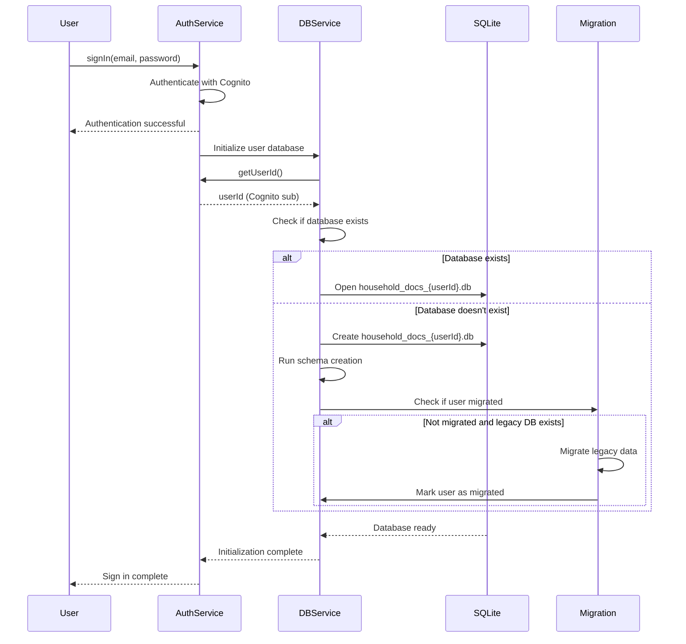
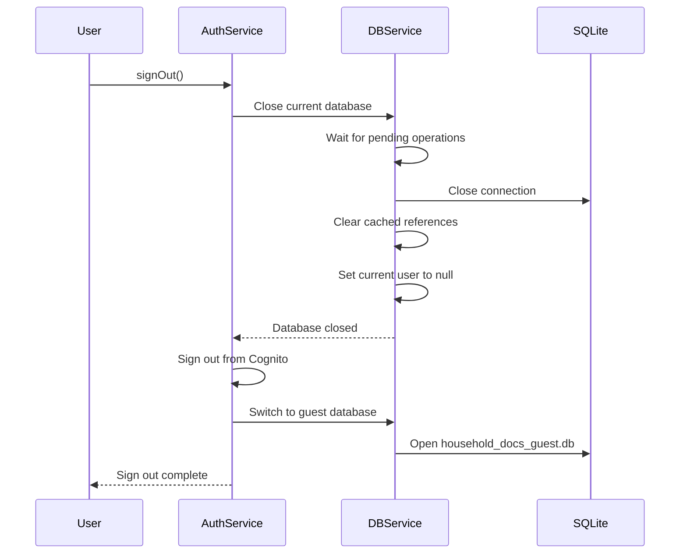

# User-Scoped Database Architecture

## Overview

The User-Scoped Database feature implements complete data isolation between users by creating separate SQLite database files for each authenticated user. This addresses a critical security vulnerability where users could see documents from previous users due to a shared local database.

**Key Benefits:**
- Complete data privacy and isolation between users
- Secure multi-user support on shared devices
- Automatic migration from legacy shared database
- Guest mode for offline-first functionality
- User-specific file storage

---

## Architecture

### Database File Structure

Each user has their own isolated database file:

```
Application Documents Directory/
├── household_docs_guest.db              # Guest/offline mode database
├── household_docs_{userId1}.db          # User 1's database
├── household_docs_{userId2}.db          # User 2's database
├── household_docs_v2.db                 # Legacy shared database (migrated)
└── files/
    ├── guest/                           # Guest user files
    │   ├── file1.pdf
    │   └── file2.jpg
    ├── {userId1}/                       # User 1's files
    │   ├── document1.pdf
    │   └── photo1.jpg
    └── {userId2}/                       # User 2's files
        ├── invoice.pdf
        └── receipt.jpg
```

**Database Naming Convention:**
- Authenticated users: `household_docs_{cognito_sub}.db`
- Guest users: `household_docs_guest.db`
- Legacy database: `household_docs_v2.db`

Where `{cognito_sub}` is the user's unique Cognito User ID (sub claim).

### Component Architecture

```
┌─────────────────────────────────────────────────────────────┐
│                     Application Layer                        │
│  (Screens, Widgets, Business Logic)                         │
└─────────────────────┬───────────────────────────────────────┘
                      │
                      ▼
┌─────────────────────────────────────────────────────────────┐
│              Authentication Service                          │
│  - Manages sign in/out lifecycle                            │
│  - Triggers database initialization                         │
│  - Provides user ID (Cognito sub)                           │
└─────────────────────┬───────────────────────────────────────┘
                      │
                      ▼
┌─────────────────────────────────────────────────────────────┐
│           NewDatabaseService (User-Scoped)                   │
│  - Tracks current user's database                           │
│  - Automatic database switching on auth changes             │
│  - Thread-safe operations with mutex                        │
│  - Legacy database migration                                │
│  - Guest database support                                   │
└─────────────────────┬───────────────────────────────────────┘
                      │
                      ▼
┌─────────────────────────────────────────────────────────────┐
│                  SQLite Databases                            │
│  - One database per user (isolated)                         │
│  - Guest database for offline mode                          │
│  - Legacy database (migration source)                       │
└─────────────────────────────────────────────────────────────┘
```

---

## Database Lifecycle

### Sign In Flow



### Sign Out Flow



### Database Switching

When the authenticated user changes (e.g., User A signs out, User B signs in):

1. **Detect user change:** Compare current user ID with new user ID
2. **Wait for operations:** Ensure all pending database operations complete
3. **Close current database:** Release all file handles and locks
4. **Clear cache:** Remove cached database references
5. **Open new database:** Open the new user's database file
6. **Update tracking:** Set current user ID to new user

This process is protected by a mutex lock to prevent concurrent switches.

---

## Key Features

### 1. Automatic Database Switching

The database service automatically detects when the authenticated user changes and switches to the correct database:

```dart
Future<Database> get database async {
  await _mutex.protect(() async {
    final currentUserId = await _getCurrentUserId();
    
    // Detect user change
    if (_database != null && _currentUserId != currentUserId) {
      await _switchDatabase(currentUserId);
    } else if (_database == null) {
      await _openDatabase(currentUserId);
    }
  });
  
  return _database!;
}
```

**Benefits:**
- No manual database management required
- Prevents data leakage between users
- Handles rapid authentication changes gracefully

### 2. Legacy Database Migration

Existing users with data in the shared database are automatically migrated:

**Migration Process:**
1. On first sign-in, check if user has been migrated (stored in SharedPreferences)
2. If not migrated and legacy database exists:
   - Open legacy database in read-only mode
   - Copy all documents and file attachments
   - Insert into user's new database (ignore conflicts)
   - Mark user as migrated in SharedPreferences
3. After all users migrated, admin can delete legacy database

**Migration Characteristics:**
- **Automatic:** Triggered on first sign-in
- **Idempotent:** Safe to run multiple times
- **Non-destructive:** Legacy database preserved until manually deleted
- **Logged:** Full migration progress logged for debugging

### 3. Guest Mode Support

Users can use the app without authentication:

**Guest Database:**
- File name: `household_docs_guest.db`
- Used when no user is authenticated
- Full offline functionality
- Data persists across app restarts

**Guest Data Migration:**
When a guest user signs in, they can migrate their guest data:
1. System detects guest database has documents
2. Prompt user to migrate guest data
3. If accepted, copy all guest documents to user's database
4. Clear guest database after successful migration

### 4. User-Specific File Storage

File attachments are stored in user-specific directories:

**Directory Structure:**
```
files/
├── guest/           # Guest user files
├── {userId1}/       # User 1's files
└── {userId2}/       # User 2's files
```

**File Path Handling:**
- Files stored in `files/{userId}/` directory
- Database stores relative paths (without userId prefix)
- Automatic directory creation on first file upload
- Complete isolation between users' files

### 5. Thread-Safe Operations

All database operations are protected by a mutex lock:

```dart
static final _mutex = Mutex();

Future<T> _withLock<T>(Future<T> Function() operation) async {
  return await _mutex.protect(operation);
}
```

**Benefits:**
- Prevents concurrent database access
- Prevents database switching during operations
- Ensures data consistency
- Handles rapid authentication changes

### 6. Comprehensive Error Handling

Robust error handling with automatic recovery:

**Error Scenarios:**
- **Database corruption:** Create new database, log error
- **Migration failure:** Log error, retry on next sign-in
- **Disk full:** Show warning, prevent new operations
- **Auth failure:** Fall back to guest database
- **Database locked:** Retry with exponential backoff

**Error Recovery:**
- Automatic retry for transient errors
- Fallback to guest database on auth failures
- Detailed error logging with context
- User-friendly error messages

### 7. Comprehensive Logging

All database lifecycle events are logged:

**Logged Events:**
- Database open (user ID, file name, timestamp)
- Database close (user ID, duration)
- Database switch (old user ID, new user ID)
- Migration start, progress, and completion
- All errors with full context and stack traces

**Log Levels:**
- **Info:** Normal operations (open, close, switch)
- **Warning:** Recoverable issues (auth failure, retry)
- **Error:** Failures requiring attention (corruption, migration failure)

---

## Migration Process

### For Existing Users

When an existing user signs in for the first time after the update:

1. **Authentication:** User signs in with email/password
2. **Database Check:** System checks if user has been migrated
3. **Migration Detection:** If not migrated and legacy database exists:
   - System logs "User not migrated, starting migration"
   - Opens legacy database in read-only mode
   - Counts documents and file attachments
4. **Data Copy:** Copies all data to user's new database
5. **Verification:** Verifies all data copied successfully
6. **Completion:** Marks user as migrated in SharedPreferences
7. **Logging:** Logs "Migration complete: X documents, Y files"

**User Experience:**
- Migration happens automatically in background
- No user action required
- All existing data preserved
- App remains responsive during migration

### For New Users

New users who sign up after the update:

1. **Sign Up:** User creates account
2. **Sign In:** User signs in for first time
3. **Database Creation:** System creates new user-specific database
4. **Schema Setup:** Runs schema creation scripts
5. **Ready:** User can start creating documents

**User Experience:**
- Seamless onboarding
- No migration needed
- Clean database from start

### For Guest Users

Users who used the app without signing in:

1. **Guest Usage:** User creates documents without authentication
2. **Sign In:** User decides to sign in
3. **Migration Prompt:** System detects guest data and prompts:
   - "You have documents from guest mode. Migrate to your account?"
   - Options: "Yes, migrate" or "No, start fresh"
4. **Migration:** If accepted, copies guest data to user database
5. **Cleanup:** Clears guest database after successful migration

**User Experience:**
- Clear choice to migrate or start fresh
- No data loss if migration accepted
- Guest database cleared after migration

---

## Database Maintenance

### List User Databases

Get a list of all user database files:

```dart
final databases = await NewDatabaseService.instance.listUserDatabases();
// Returns: ['household_docs_guest.db', 'household_docs_abc123.db', ...]
```

### Delete User Database

Delete a specific user's database (e.g., after account deletion):

```dart
await NewDatabaseService.instance.deleteUserDatabase(userId);
```

**Safety:**
- Closes database if currently open
- Deletes database file from disk
- Logs deletion event

### Vacuum Database

Optimize current user's database:

```dart
await NewDatabaseService.instance.vacuumDatabase();
```

**Benefits:**
- Reclaims unused space
- Optimizes database performance
- Reduces file size

### Get Database Statistics

Get statistics about current user's database:

```dart
final stats = await NewDatabaseService.instance.getDatabaseStats();
// Returns:
// {
//   'document_count': 42,
//   'file_attachment_count': 15,
//   'log_count': 1234,
//   'file_size_bytes': 2048576,
//   'file_size_mb': '1.95',
//   'user_id': 'abc123',
//   'database_file': 'household_docs_abc123.db'
// }
```

---

## Security Considerations

### Data Isolation

**Database Level:**
- Each user has completely separate database file
- No shared tables or data structures
- File system permissions prevent cross-user access

**File Level:**
- Each user has separate file directory
- File paths validated before access
- S3 keys include user's Identity Pool ID

### User ID Validation

User IDs are validated and sanitized before use:

```dart
String _sanitizeUserId(String userId) {
  // Remove unsafe characters
  final sanitized = userId.replaceAll(RegExp(r'[^a-zA-Z0-9_-]'), '_');
  
  // Limit length
  if (sanitized.length > 50) {
    return sanitized.substring(0, 50);
  }
  
  return sanitized;
}
```

**Prevents:**
- Path traversal attacks
- Invalid file names
- File system errors

### Database Encryption

**Current State:**
- Databases are not encrypted at rest
- Relies on device-level encryption

**Future Enhancement:**
- Add SQLCipher for database encryption
- Encrypt files before storage
- Key management with AWS KMS

### Secure Deletion

When deleting user data:

1. Close database connection
2. Delete database file
3. Delete user's file directory
4. Clear cached references
5. Log deletion event

**Future Enhancement:**
- Overwrite database file before deletion
- Secure file shredding

---

## Performance Considerations

### Database Switching Overhead

**Typical Switch Time:** 50-200ms

**Optimization Strategies:**
- Cache current user ID to minimize switches
- Use mutex to prevent concurrent switches
- Close database cleanly to avoid corruption

### Migration Performance

**Typical Migration Time:**
- 100 documents: ~500ms
- 1000 documents: ~2-3 seconds
- 10000 documents: ~20-30 seconds

**Optimization Strategies:**
- Use transactions for batch inserts
- Read-only mode for legacy database
- Background migration (non-blocking UI)

### Memory Usage

**Per Database:**
- Connection overhead: ~1-2 MB
- Query cache: ~500 KB
- Total: ~2-3 MB per open database

**Optimization:**
- Only one database open at a time
- Close database on sign out
- Clear cached references

### Disk Usage

**Per User:**
- Empty database: ~20 KB
- 100 documents: ~100-200 KB
- 1000 documents: ~1-2 MB
- File attachments: Variable (user-dependent)

**Optimization:**
- Vacuum database periodically
- Delete orphaned files
- Compress old databases

---

## Testing

### Unit Tests

**Database Service Tests:**
- Database file naming with various user IDs
- User ID sanitization edge cases
- Database opening and closing
- Database switching between users
- Guest database usage
- Concurrent access with mutex

**Migration Tests:**
- Legacy database detection
- Data migration correctness
- Migration idempotency
- Migration failure recovery
- Guest data migration

**File Service Tests:**
- User-specific directory creation
- File path generation
- File isolation between users

### Property-Based Tests

**Property 9: Concurrent operation safety**
- Validates: Requirements 8.1, 8.2, 8.3
- Tests concurrent database operations are serialized
- Ensures no data corruption or race conditions

### Integration Tests

**Multi-User Isolation Test:**
1. User A signs in, creates documents, signs out
2. User B signs in, creates documents, signs out
3. User A signs in again
4. Verify User A sees only their documents
5. Verify complete data isolation

**Legacy Migration Test:**
1. Create legacy database with test documents
2. Sign in as user
3. Verify migration occurs automatically
4. Verify all documents migrated correctly
5. Verify migration doesn't repeat

**Guest Mode Flow Test:**
1. Create documents as guest user
2. Sign in as authenticated user
3. Verify guest data migration prompt appears
4. Accept migration
5. Verify guest data migrated to user database
6. Verify guest database cleared

**Rapid Authentication Changes Test:**
1. Perform 20 rapid sign-in/sign-out cycles
2. Verify system remains stable
3. Verify no data corruption
4. Verify no file handle leaks
5. Verify correct database always open

---

## Troubleshooting

See [USER_SCOPED_DATABASE_TROUBLESHOOTING.md](USER_SCOPED_DATABASE_TROUBLESHOOTING.md) for detailed troubleshooting guide.

**Common Issues:**
- Migration not occurring
- Database not switching
- Guest data not migrating
- File access errors
- Database corruption

---

## API Reference

### NewDatabaseService

#### Properties

```dart
Future<Database> get database
```
Get the current user's database. Automatically switches if user changed.

#### Methods

```dart
Future<void> close()
```
Close the current database connection.

```dart
Future<void> migrateLegacyDatabase(String userId)
```
Migrate data from legacy shared database to user-specific database.

**Parameters:**
- `userId`: The user's Cognito sub claim

**Throws:**
- `DatabaseException` if migration fails

```dart
Future<bool> hasBeenMigrated(String userId)
```
Check if user has been migrated from legacy database.

**Parameters:**
- `userId`: The user's Cognito sub claim

**Returns:** `true` if user has been migrated, `false` otherwise

```dart
Future<List<String>> listUserDatabases()
```
List all user database files.

**Returns:** List of database file names

```dart
Future<void> deleteUserDatabase(String userId)
```
Delete a specific user's database file.

**Parameters:**
- `userId`: The user's Cognito sub claim

```dart
Future<void> vacuumDatabase()
```
Optimize the current user's database.

```dart
Future<Map<String, dynamic>> getDatabaseStats()
```
Get statistics about the current user's database.

**Returns:** Map with keys:
- `document_count`: Number of documents
- `file_attachment_count`: Number of file attachments
- `log_count`: Number of log entries
- `file_size_bytes`: Database file size in bytes
- `file_size_mb`: Database file size in MB
- `user_id`: Current user ID
- `database_file`: Database file name

### AuthenticationService

#### Modified Methods

```dart
Future<void> signOut()
```
Sign out the current user and close their database.

```dart
Future<AuthResult> signIn(String email, String password)
```
Sign in and initialize user's database (including migration if needed).

### FileService

#### Modified Methods

```dart
Future<String> uploadFile({
  required String localFilePath,
  required String syncId,
  required String identityPoolId,
})
```
Upload file from user-specific directory to S3.

```dart
Future<String> downloadFile({
  required String s3Key,
  required String syncId,
  required String identityPoolId,
})
```
Download file from S3 to user-specific directory.

```dart
Future<void> clearUserFiles()
```
Clear all files for current user (for testing/cleanup).

---

## Future Enhancements

### Planned Features

1. **Database Encryption**
   - Add SQLCipher for encrypted databases
   - Encrypt files before storage
   - Key management with AWS KMS

2. **Automatic Cleanup**
   - Delete old user databases after account deletion
   - Remove orphaned database files
   - Compress inactive databases

3. **Database Backup**
   - Backup user databases to cloud storage
   - Restore from backup on device change
   - Incremental backup for efficiency

4. **Multi-Device Sync**
   - Sync database changes across user's devices
   - Conflict resolution for concurrent changes
   - Real-time sync with AppSync

5. **Database Compression**
   - Compress old databases to save space
   - Decompress on access
   - Automatic compression of inactive databases

6. **Analytics**
   - Track database sizes
   - Monitor operation performance
   - Identify optimization opportunities

---

## Conclusion

The User-Scoped Database architecture provides:

- **Complete Data Isolation:** Each user has their own database
- **Security:** No data leakage between users
- **Seamless Migration:** Automatic migration from legacy database
- **Guest Mode:** Full offline functionality without authentication
- **Robust Error Handling:** Automatic recovery from errors
- **Performance:** Optimized for mobile devices
- **Maintainability:** Clean architecture with clear separation of concerns

This architecture ensures user data privacy and security while maintaining the app's offline-first functionality and user experience.

---

**Last Updated:** January 30, 2026
**Version:** 1.0.0
